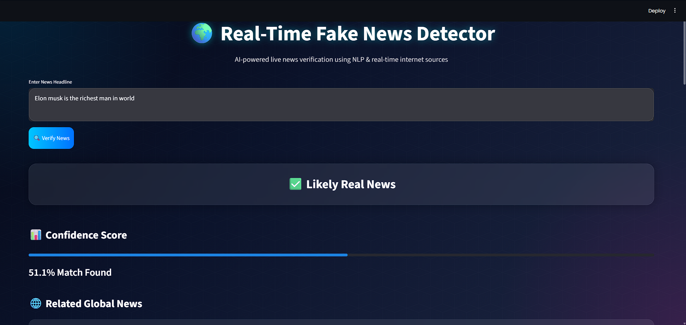

# 🌍 Real-Time Fake News Detection System

An AI-powered Fake News Detection System that verifies news headlines using real-time internet news articles and Natural Language Processing (NLP).

The application fetches live news from online sources, compares it with user-entered news using NLP similarity analysis, and predicts whether the news is likely real or fake.

## 📸 Project Preview
<p align="center">  </p>

## 📌 Overview

The Real-Time Fake News Detection System is designed to identify potentially fake news articles by comparing user-provided news headlines with trusted live news sources available on the internet.

Instead of relying on static datasets only, the system fetches real-time news articles using NewsAPI and performs similarity analysis using:
- **TF-IDF Vectorization**
- **Cosine Similarity**
- **NLP-based text processing**

The application provides a modern interactive interface built with Streamlit and displays:
- Prediction results
- Confidence score
- Related live news articles
- News sources

## 🚀 Features
- 🌐 **Real-time news verification**
- 📰 **Live news fetching** using NewsAPI
- 🤖 **NLP-based similarity analysis**
- 📊 **Confidence score visualization**
- 🌍 **Modern news-style UI**
- ⚡ **Fast and lightweight system**
- 🧠 **TF-IDF Vectorization**
- 🔍 **Cosine Similarity Matching**
- 🎨 **Interactive Streamlit interface**

## 🛠️ Technologies Used
- Python
- Streamlit
- Scikit-learn
- Pandas
- NumPy
- Requests API
- Natural Language Processing (NLP)

## 🧠 Machine Learning Concepts Used

### 🔹 TF-IDF Vectorization
Converts text into numerical vectors for machine learning analysis.

### 🔹 Cosine Similarity
Measures similarity between:
- User-entered news
- Real-time news articles

### 🔹 NLP Processing
Used for text cleaning and feature extraction.

## 📂 Project Structure
```text
fake-news-detector/
│── assets/
│    └── project_showcase.png
│
│── src/
│    ├── fetch_news.py
│    ├── similarity.py
│    ├── detector.py
│
│── app.py
│── requirements.txt
│── README.md
```

## ⚙️ How the System Works

1️⃣ **User Input**  
The user enters a news headline or article.

2️⃣ **Live News Fetching**  
The system fetches related live news articles from NewsAPI.

3️⃣ **NLP Processing**  
The entered news and fetched articles are converted into numerical vectors using TF-IDF.

4️⃣ **Similarity Analysis**  
Cosine similarity compares:
- User news
- Real internet news articles

5️⃣ **Prediction Generation**  
The system predicts:
- ✅ Likely Real News
- ⚠️ Partially Verified News
- 🚫 Likely Fake News

## 🌐 User Interface
The project includes a modern news-style interface featuring:
- Dark futuristic theme
- Interactive cards
- Live news display
- Confidence score progress bar
- Glassmorphism design effects

## 📡 API Integration
This project uses NewsAPI for fetching real-time news articles.
- **API Provider:** NewsAPI

## 💡 Learning Outcomes
This project helps in understanding:
- Real-world NLP applications
- API integration in ML projects
- TF-IDF Vectorization
- Cosine similarity algorithms
- Building interactive AI applications
- End-to-end ML workflow

## 🚀 Future Improvements
- 🧠 BERT-based fake news detection
- 🌍 Multi-language support
- ☁️ Cloud deployment using AWS/GCP
- 🔎 Fact-checking API integration
- 📈 Advanced credibility scoring
- 🤖 AI-generated explanation system

## 🎯 Use Cases
- News verification
- Social media content analysis
- Educational NLP projects
- AI-powered fact-checking systems

## ⭐ Conclusion
The Real-Time Fake News Detection System demonstrates how Machine Learning, NLP, and live internet data can be combined to build a practical and intelligent fake news verification platform.

This project is beginner-friendly while still demonstrating real-world AI concepts and API integration techniques.

## 📬 Contact
For suggestions, improvements, or collaboration opportunities, feel free to connect.
